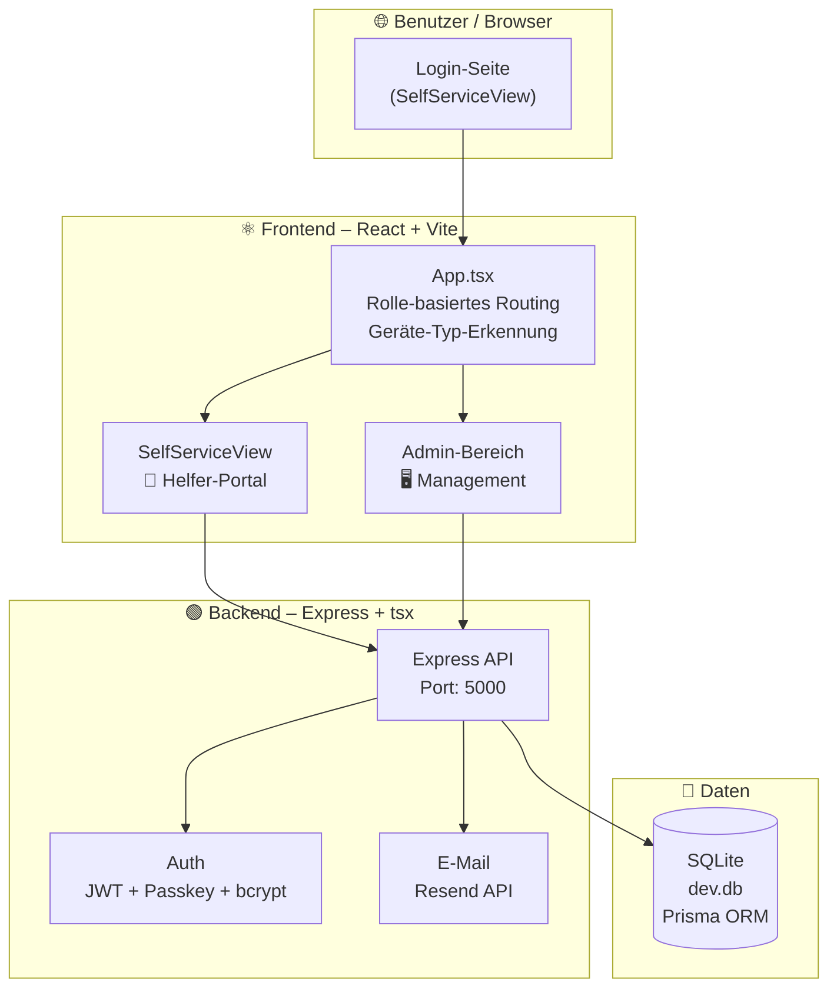
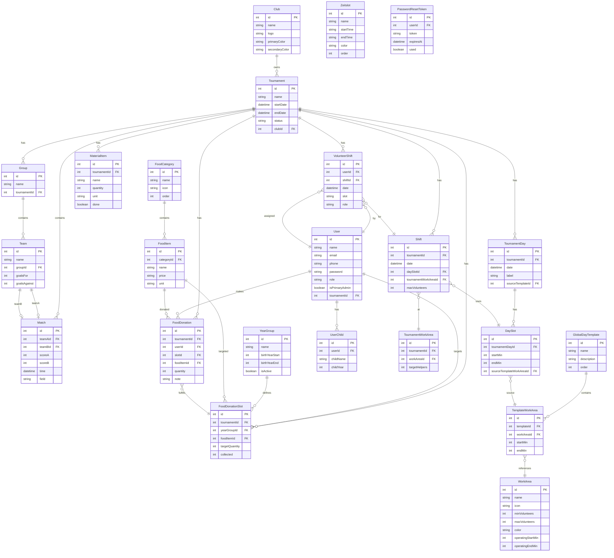

# ⚽ Turnier-Planer

Webanwendung zur Planung von Fußballturnieren, Verwaltung von Helfer-Dienstplänen und Koordination von Lebensmittel-Spenden.

## Features
- ✅ Turniere, Gruppen & Spielplan erstellen
- ✅ Ergebnisse live pflegen
- 👥 Wochen-Dienstplan für Helfer mit Drag & Drop
- 📅 Gantt-Chart-Vorlagen für Tag-Planung (TemplateWorkAreas)
- 🍞 Lebensmittel-Spendenmanagement (Jahrgang-basiert)
- 🏅 Vereinsbranding (2-Farben-Theming + Logo)
- 🔐 SelfService-Portal mit Passkey-Authentifizierung
- 👤 Rolle-basierte Weiterleitung nach Login (Admin/Organisator vs. Helfer)
- 📱 Responsive Design (Mobile/Tablet/Desktop)
- 📧 Passwort-zurücksetzen per E-Mail (Resend)
- 🐳 Dockerized (Backend + Frontend)
- 🚀 GitHub Actions CI/CD Pipeline

---

## Architektur



### Tech Stack

| Schicht       | Technologie                          |
|---------------|--------------------------------------|
| Frontend      | React 18 + Vite + TypeScript         |
| Backend       | Express.js + tsx (TypeScript Runtime)|
| Datenbank     | SQLite + Prisma ORM                  |
| Auth          | JWT (`jsonwebtoken`) + Passkey + bcrypt |
| E-Mail        | Resend API                           |
| Deployment    | Docker Compose + GitHub Actions      |
| CI/CD         | GHCR (GitHub Container Registry)     |

### Ansicht nach Login

**Alle Benutzer** landen nach dem Login auf der **SelfService-Seite** (`SelfServiceView`).

| Rolle des Benutzers | Verhalten |
|---------------------|-----------|
| Alle (HELPER, ORGANIZER, ADMIN) | SelfService-Portal (`SelfServiceView`) |

- **Helfer**: Nutzen das SelfService-Portal (Dienstplan, Spenden, Buchung)
- **Admins/Organisatoren**: Können über den Button „⚙️ Admin-Bereich" in den Admin-Bereich wechseln.

> ℹ️ **Verbindliche Quelle des Datenmodells ist [`backend/prisma/schema.prisma`](backend/prisma/schema.prisma).**
> Das folgende Diagramm und das Data Dictionary sind eine vereinfachte, teils historische
> Übersicht. Wichtigste Abweichung: Die Helfer-Entität heißt im Code **`User`** (nicht `Volunteer`),
> die Rolle ist ein String-Enum **`role`** mit Werten `HELPER` / `ORGANIZER` / `ADMIN`
> (nicht ein `roles`-JSON-Array), und Kinder liegen im Modell **`UserChild`**.



### Datenmodell-Übersicht

> **Vollständig und immer aktuell: [`docs/datenmodell.md`](docs/datenmodell.md)** —
> aus `backend/prisma/schema.prisma` erzeugt (`npm run docs:datamodel` im Ordner
> `backend`), die CI prüft bei jedem Lauf, dass beides zusammenpasst.
>
> Die Tabelle an dieser Stelle wurde früher von Hand gepflegt und war auf etwa
> der Hälfte der Modelle stehengeblieben. Hier steht deshalb nur noch, wie die
> Teile zusammenhängen.

Die Helferplanung ist die Kette, um die sich das meiste dreht:

```
WorkArea            Stammdaten-Katalog: "Küche", "Grillstand", ...
   │ beim Einrichten eines Turniers kopiert
TournamentWorkArea  Turnier-eigene Kopie (Änderungen am Katalog wirken nicht rückwirkend)
   │
Shift               Eine Schicht: Turniertag × Zeitfenster × Arbeitsbereich
   │
VolunteerShift      Die Zusage einer Person auf diese Schicht
```

Der Tagesaufbau daneben:

```
GlobalDayTemplate   Vorlage eines Tagtyps ("Turniersamstag")
   │ TemplateWorkArea: welcher Bereich von wann bis wann
TournamentDay       Konkreter Turniertag, erzeugt aus der Vorlage
   │ DaySlot: die Zeitfenster dieses Tages, pro Tag eindeutig über (Start, Ende)
Shift               hängt an genau einem DaySlot und einem TournamentWorkArea
```

Ein `DaySlot` ist **ein Zeitfenster des Tages** — nicht die Kopie eines
Arbeitsbereichs. Welche Bereiche in einem Fenster arbeiten, sagen die Schichten.

Der Rest gliedert sich in **Spielbetrieb** (`YearGroup`, `Group`, `Team`,
`Match`, `Field`, `StandingsEntry`, `KnockoutBracket`), **Menschen** (`User`
mit `UserRoleEntry` für Mehrfachrollen, `VolunteerChild`, `Passkey`,
`PushSubscription`, `UserNotification`) und **Verpflegung**
(`FoodDonationSlot`, `FoodDonation`, `FoodItem`, `FoodCategory`,
`ShoppingCatalogItem`, `ShoppingListItem`).
---

## Data Dictionary

### 🏅 Club (Verein)
| Feld | Typ | Nullable | Beschreibung |
|------|-----|----------|-------------|
| `id` | Int (PK) | ❌ | Primärschlüssel |
| `name` | String | ❌ | Vereinsname |
| `logo` | String | ✅ | Logo als Base64-DataURI |
| `primaryColor` | String | ❌ | Hauptfarbe (#hex), Header/Gradients |
| `secondaryColor` | String | ❌ | Sekundärfarbe (#hex), Buttons/Akzente |

### 🏟️ Tournament (Turnier)
| Feld | Typ | Nullable | Beschreibung |
|------|-----|----------|-------------|
| `id` | Int (PK) | ❌ | Primärschlüssel |
| `name` | String | ❌ | Turniername |
| `description` | String | ✅ | Beschreibung/Details |
| `startDate` | DateTime | ❌ | Erster Turniertag |
| `endDate` | DateTime | ❌ | Letzter Turniertag |
| `status` | String | ❌ | `aktiv` / `beendet` / `archiviert` |
| `clubId` | Int (FK) | ✅ | Verknüpfter Verein → Club.id |

### 👥 Group (Gruppe)
| Feld | Typ | Nullable | Beschreibung |
|------|-----|----------|-------------|
| `id` | Int (PK) | ❌ | Primärschlüssel |
| `name` | String | ❌ | Gruppenname (z.B. "Gruppe A") |
| `tournamentId` | Int (FK) | ❌ | Gehört zu → Tournament.id |

### ⚽ Team (Mannschaft)
| Feld | Typ | Nullable | Beschreibung |
|------|-----|----------|-------------|
| `id` | Int (PK) | ❌ | Primärschlüssel |
| `name` | String | ❌ | Mannschaftsname |
| `groupId` | Int (FK) | ❌ | Gehört zu → Group.id |
| `goalsFor` | Int | ❌ | Erzielte Tore |
| `goalsAgainst` | Int | ❌ | Gegene Tore |

### 📋 Match (Begegnung)
| Feld | Typ | Nullable | Beschreibung |
|------|-----|----------|-------------|
| `id` | Int (PK) | ❌ | Primärschlüssel |
| `tournamentId` | Int (FK) | ❌ | Gehört zu → Tournament.id |
| `teamAId` | Int (FK) | ❌ | Team A → Team.id |
| `teamBId` | Int (FK) | ❌ | Team B → Team.id |
| `scoreA` | Int | ✅ | Ergebnis Team A (null = ausstehend) |
| `scoreB` | Int | ✅ | Ergebnis Team B (null = ausstehend) |
| `field` | String | ❌ | Spielfeld (Standard: "Feld 1") |
| `time` | DateTime | ❌ | Angesetzt Spielzeit |

### 👤 User (Helferin/Helfer – im Code `User`, Tabelle `users`)
| Feld | Typ | Nullable | Beschreibung |
|------|-----|----------|-------------|
| `id` | Int (PK) | ❌ | Primärschlüssel |
| `name` | String | ❌ | Vollständiger Name |
| `email` | String | ✅ | E-Mail-Adresse (Login/Passwort-Zurücksetzen) |
| `phone` | String | ✅ | Telefonnummer |
| `password` | String | ✅ | bcrypt-Hash (optional, nur bei Registrierung gesetzt) |
| `role` | String (Enum-artig) | ❌ | `HELPER` / `ORGANIZER` / `ADMIN` (Default: `HELPER`) |
| `isPrimaryAdmin` | Boolean | ❌ | Primärer Admin (E-Mail-Absender), Default: false |
| `consentGiven` / `consentDate` | Boolean / DateTime | ✅ | DSGVO-Einwilligung |
| `tournamentId` | Int (FK) | ✅ | Aktuelles Turnier → Tournament.id |

> Kinder-Daten liegen in **`UserChild`** (nicht mehr als `childName`/`childYear` am User).

### 👶 VolunteerChild (Kind einer Helferin)
| Feld | Typ | Nullable | Beschreibung |
|------|-----|----------|-------------|
| `id` | Int (PK) | ❌ | Primärschlüssel |
| `volunteerId` | Int (FK) | ❌ | Gehört zu → Volunteer.id |
| `childName` | String | ❌ | Name des Kindes |
| `childYear` | Int | ❌ | Geburtsjahr (z.B. 2015 für Jahrgang 2013) |

### 📅 VolunteerShift (Helfer-Einsatz)
| Feld | Typ | Nullable | Beschreibung |
|------|-----|----------|-------------|
| `id` | Int (PK) | ❌ | Primärschlüssel |
| `volunteerId` | Int (FK) | ❌ | Helferin/Helfer → Volunteer.id |
| `shiftId` | Int (FK) | ✅ | Konkreter Job-Slot → Shift.id |
| `date` | DateTime | ❌ | Einsatzdatum |
| `slot` | String | ❌ | Zeitslot-Name (z.B. "09:00–12:00") |
| `role` | String | ❌ | Rolle/Aufgabe |

### 📍 Arbeitsbereich (Station)
| Feld | Typ | Nullable | Beschreibung |
|------|-----|----------|-------------|
| `id` | Int (PK) | ❌ | Primärschlüssel |
| `name` | String | ❌ | Name (z.B. "Verkaufsstand", "Grillstand") |
| `icon` | String | ❌ | Emoji-Icon (Standard: "📍") |
| `minVolunteers` | Int | ❌ | Mindestanzahl Helfer (Default: 2) |
| `maxVolunteers` | Int | ❌ | Maximalanzahl Helfer (Default: 8) |
| `color` | String | ❌ | Farbwert für UI-Badges (#hex) |

### ⏰ Zeitslot (Zeitfenster)
| Feld | Typ | Nullable | Beschreibung |
|------|-----|----------|-------------|
| `id` | Int (PK) | ❌ | Primärschlüssel |
| `name` | String | ❌ | Anzeigename (z.B. "Morgen") |
| `startTime` | String | ❌ | Startzeit (ISO 8601: "09:00") |
| `endTime` | String | ❌ | Endzeit (ISO 8601: "12:00") |
| `color` | String | ❌ | Farbwert für UI (#hex) |
| `order` | Int | ❌ | Sortierreihenfolge (Default: 0) |

### 🔧 Shift (Job-Slot)
| Feld | Typ | Nullable | Beschreibung |
|------|-----|----------|-------------|
| `id` | Int (PK) | ❌ | Primärschlüssel |
| `tournamentId` | Int (FK) | ❌ | Gehört zu → Tournament.id |
| `date` | DateTime | ❌ | Einsatzdatum |
| `zeitslotId` | Int (FK) | ✅ | Zeitfenster → Zeitslot.id |
| `arbeitsbereichId` | Int (FK) | ✅ | Station → Arbeitsbereich.id |
| `maxVolunteers` | Int | ❌ | Max. Helfer (Default: 8, überschreibt Arbeitsbereich) |

### 📂 FoodCategory (Lebensmittel-Kategorie)
| Feld | Typ | Nullable | Beschreibung |
|------|-----|----------|-------------|
| `id` | Int (PK) | ❌ | Primärschlüssel |
| `name` | String | ❌ | Kategoriename (z.B. "Kuchen", "Getränke") |
| `icon` | String | ❌ | Emoji-Icon (Standard: "🍽️") |
| `order` | Int | ❌ | Sortierreihenfolge (Default: 0) |

### 🍰 FoodItem (Lebensmittel-Artikel)
| Feld | Typ | Nullable | Beschreibung |
|------|-----|----------|-------------|
| `id` | Int (PK) | ❌ | Primärschlüssel |
| `categoryId` | Int (FK) | ❌ | Kategorie → FoodCategory.id |
| `name` | String | ❌ | Artikelname (z.B. "Selbstgemachter Kuchen") |
| `price` | String | ✅ | Preisangabe (optional) |
| `unit` | String | ❌ | Einheit (Default: "Stk") |

### 🎓 YearGroup (Jahrgang)
| Feld | Typ | Nullable | Beschreibung |
|------|-----|----------|-------------|
| `id` | Int (PK) | ❌ | Primärschlüssel |
| `name` | String | ❌ | Anzeigename (z.B. "Jahrgang 2013") |
| `birthYearStart` | Int | ❌ | Startjahr der Altersgruppe |
| `birthYearEnd` | Int | ❌ | Endjahr der Altersgruppe |
| `order` | Int | ❌ | Sortierreihenfolge (Default: 0) |
| `isActive` | Boolean | ❌ | Aktiv/Inaktiv (Default: true) |

### 🎯 FoodDonationSlot (Spenden-Ziel)
| Feld | Typ | Nullable | Beschreibung |
|------|-----|----------|-------------|
| `id` | Int (PK) | ❌ | Primärschlüssel |
| `tournamentId` | Int (FK) | ❌ | Gehört zu → Tournament.id |
| `yearGroupId` | Int (FK) | ✅ | Ziel-Jahrgang → YearGroup.id |
| `foodItemId` | Int (FK) | ✅ | Gewünschter Artikel → FoodItem.id |
| `targetQuantity` | Int | ❌ | Zielmenge (Default: 0) |
| `collected` | Int | ❌ | Aktuelle gespendete Menge (wird automatisch inkrementiert) |

### 📦 FoodDonation (Konkrete Spende)
| Feld | Typ | Nullable | Beschreibung |
|------|-----|----------|-------------|
| `id` | Int (PK) | ❌ | Primärschlüssel |
| `tournamentId` | Int (FK) | ❌ | Gehört zu → Tournament.id |
| `volunteerId` | Int (FK) | ❌ | Spender:in → Volunteer.id |
| `foodDonationSlotId` | Int (FK) | ✅ | Verknüpfter Slot → FoodDonationSlot.id |
| `foodItemId` | Int (FK) | ❌ | Gespendeter Artikel → FoodItem.id |
| `quantity` | Int | ❌ | Menge |
| `note` | String | ✅ | Notiz/Freitext |

### 📋 MaterialItem (Materialgegenstand)
| Feld | Typ | Nullable | Beschreibung |
|------|-----|----------|-------------|
| `id` | Int (PK) | ❌ | Primärschlüssel |
| `tournamentId` | Int (FK) | ❌ | Gehört zu → Tournament.id |
| `name` | String | ❌ | Gegenstandsname |
| `quantity` | Int | ❌ | Menge (Default: 1) |
| `unit` | String | ❌ | Einheit (Default: "Stk") |
| `done` | Boolean | ❌ | Abgehakt/Erledigt (Default: false) |

### 🔑 PasswordResetToken (Passwort-Zurücksetzen)
| Feld | Typ | Nullable | Beschreibung |
|------|-----|----------|-------------|
| `id` | Int (PK) | ❌ | Primärschlüssel |
| `volunteerId` | Int (FK) | ❌ | Gehört zu → Volunteer.id |
| `token` | String | ❌ | Einmaliger Reset-Token (unique) |
| `expiresAt` | DateTime | ❌ | Ablaufzeit des Tokens |
| `used` | Boolean | ❌ | Bereits verwendet (Default: false) |

---

## Datenbank-Migrationen

Das Schema wird per **`prisma db push --accept-data-loss`** synchronisiert, nicht
über eine Migrationskette. Das ist eine bewusste Entscheidung — die Details und
die Absicherung stehen in
[PROJECT_MEMORY.md](PROJECT_MEMORY.md#%EF%B8%8F-database-migration-strategy).

| Ort | Befehl |
|-----|--------|
| **CI/CD** (deploy.yml) | `npx prisma db push --accept-data-loss` auf eine frische `ci.db` |
| **Docker Build** (Dockerfile) | `RUN npx prisma db push --accept-data-loss` |
| **Container-Start** (docker-entrypoint.sh) | Backup → Datenumbau-Skripte → `npx prisma db push` |

`backend/prisma/migrations/` enthält nur noch einen historischen Rest und wird
von nichts ausgeführt.

### Schema ändern
```bash
cd backend
npx prisma db push          # Node-Prozesse vorher beenden (Windows: DLL-Lock)
npm run docs:datamodel      # docs/datenmodell.md neu erzeugen und mitcommitten
```

Braucht die Änderung einen Datenumbau — Daten umhängen, Duplikate zusammenführen,
neue Felder füllen —, gehört der als idempotentes Skript nach
`backend/scripts/` und wird im `docker-entrypoint.sh` eingehängt: **vor**
`db push`, wenn die Änderung sonst an den Altdaten scheitert (etwa ein neuer
Unique-Index), sonst danach.

### SQLite-Hinweis
SQLite unterstützt `DROP COLUMN` erst ab 3.35.0 (2021). `db push` löst das über
Table Recreation — deshalb läuft im Entrypoint vor jedem Push ein Backup
(`scripts/backup-db.cjs`). Das ist der einzige Rückweg.

---

## Testumgebung kennzeichnen

Test und Produktion laufen aus demselben Image. Damit niemand versehentlich auf
der Testumgebung landet und dort vergeblich sein echtes Passwort probiert, wird
sie über zwei Umgebungsvariablen als solche markiert — **nur auf dem Testhost**:

```yaml
APP_ENV: "test"                                            # oder "staging"
PRODUCTION_URL: "https://machdasturnier.mygate.dedyn.io"   # Ziel des Absprung-Knopfes
```

Dann zeigt die App ein schwarz-gelbes Streifenband am oberen Rand und —
solange niemand angemeldet ist — einen blockierenden Hinweis mit dem Knopf
„Zur echten App wechseln". Zusätzlich tragen Browsertitel (`[TEST] …`) und
Themenfarbe die Kennzeichnung, damit auch eine auf dem Startbildschirm
abgelegte Testversion erkennbar bleibt.

**Ohne `APP_ENV` ändert sich nichts.** Der Standard ist bewusst „Produktion":
Eine vergessene Variable macht die Testumgebung still, ein fälschlich als Test
markiertes Produktivsystem würde dagegen alle Nutzer verunsichern und sie zum
Wegklicken erziehen.

Abfragen lässt sich der Zustand über `GET /api/environment` (öffentlich, weil
die Anmeldeseite ihn braucht).

---


## Lokaler Start

```bash
# Dependencies installieren
cd backend && npm install && cd ..
cd frontend && npm install && cd ..

# Datenbank initialisieren (Schema aus schema.prisma anlegen)
cd backend && npx prisma db push && cd ..

# Server starten
docker compose up --build
```

🔗 Frontend: http://localhost:8080  
🔗 Backend API: http://localhost:5000

---

## Deployment (GitHub Actions)

Die Applikation wird vollautomatisch per GitHub Actions als Docker-Container gebaut.

**Wichtig:** Ein normaler Commit auf `master` löst **keinen** Build aus, um Ressourcen zu sparen und unfertige Versionen zu vermeiden.

### Ein Deployment auslösen

Es gibt zwei Wege, um eine neue Version (Image) zu bauen:

1. **Version Tag (Best Practice):**
   Wenn du eine stabile Version veröffentlichen willst, erstelle lokal einen Git-Tag und pushe ihn:
   ```bash
   git tag v1.0.0
   git push origin v1.0.0
   ```
   GitHub Actions erkennt den Tag `v...` und baut automatisch das Image.

2. **Manuell anstoßen:**
   Gehe auf GitHub unter **Actions** -> **Build & Push Docker Image** und klicke rechts auf **Run workflow**.

*(Hinweis zur Datenbank: Beim allerersten Start in Produktion sorgt die Ignition Phase (`prisma/seed.ts`) dafür, dass Standard-Lebensmittel und Arbeitsbereiche automatisch angelegt werden. Migrationen werden vor dem Seed ausgeführt – die DB ist immer auf dem neuesten Schema-Stand).*

### Zugriff über eine einzige Domain
Alle Funktionen sind über **eine Subdomain** erreichbar:

| URL | Ansicht |
|-----|---------|
| `https://turnier-planer.mygate.dedyn.io` | SelfServiceView (Login + Helfer-Portal) |
| `?view=privacy` | Datenschutzerklärung |
| `?view=impressum` | Impressum |

> ℹ️ Der Admin-Bereich wird **nicht** über die URL erreicht, sondern nach dem Login
> über den Button „⚙️ Admin-Bereich" in der SelfService-Ansicht.

---

## Umgebungsvariablen

Alle Variablen liest ausschließlich das Backend (`backend/src/...`) zur Laufzeit aus
`process.env`. Für lokale Entwicklung: `backend/.env.example` nach `backend/.env`
kopieren und ausfüllen. Für Produktion: siehe [Deployment auf dem Server](#deployment-auf-dem-server-podmanquadlet)
weiter unten.

| Variable | Pflicht? | Default ohne Wert | Zweck |
|---|---|---|---|
| `JWT_SECRET` | **Ja** | – (Server startet nicht) | Signiert/verifiziert Login-Tokens. Mind. 16 Zeichen, z.B. via `openssl rand -hex 32`. |
| `DATABASE_URL` | Nein | `file:./prisma/data/dev.db` (Dockerfile) | Pfad zur SQLite-Datenbank. Muss zum Volume-Mount passen, sonst ist die DB nach jedem Neustart leer. |
| `FRONTEND_URL` | Empfohlen | `http://localhost:5173` | Basis-URL für Links in E-Mails/Push (z.B. Passwort-Reset). **Fehlt sie in Produktion, zeigen Reset-Links auf localhost und funktionieren nicht** – das ist kein Theoriefall, sondern bereits einmal aufgetreten. |
| `RESEND_API_KEY` | Nein | – (E-Mail-Versand wird übersprungen, nur geloggt) | API-Key für [Resend](https://resend.com) (Passwort-Reset-E-Mails). |
| `EMAIL_FROM` | Nein | `Macht das Turnier! <noreply@mygate.dedyn.io>` | Absenderadresse. Muss bei Resend als Absender verifiziert sein, sonst schlägt der Versand mit einem 422-Fehler fehl. Format zwingend `email@domain.tld` oder `Name <email@domain.tld>`. |
| `ADMIN_EMAILS` | Nein | – (niemand wird automatisch Admin) | Kommagetrennte E-Mail-Adressen, die bei Login/Registrierung automatisch die Rolle `ADMIN` erhalten. |
| `VAPID_PUBLIC_KEY` / `VAPID_PRIVATE_KEY` | Nein (aber als Paar) | – (Web-Push bleibt deaktiviert, nur eine Warnung im Log) | Schlüsselpaar für Web-Push-Benachrichtigungen. Gemeinsam erzeugen mit `npx web-push generate-vapid-keys`. |
| `VAPID_MAILTO` | Nein | `mailto:noreply@mygate.dedyn.io` | Kontaktadresse, die Push-Provider bei Problemen mit einem Abo kontaktieren können. |
| `PORT` | Nein | `5000` | Port, auf dem das Backend lauscht. |

**Wichtig bei allen Werten mit Leerzeichen** (z.B. `EMAIL_FROM`, `FRONTEND_URL` falls sie
je ein Leerzeichen enthalten sollte): In einer systemd/Quadlet `Environment=`-Zeile
*innerhalb* einer Unit-Datei wird der Wert sonst am ersten Leerzeichen abgeschnitten
(führte bereits zu kaputten Reset-Links in Produktion). In Docker Compose (`environment:`)
oder einer `EnvironmentFile=` (siehe unten) tritt dieses Problem nicht auf. Siehe die
Beispiel-Dateien unter [`deploy/`](deploy/) für die empfohlene, robuste Variante.

---

## Deployment auf dem Server (Podman/Quadlet)

Produktiv läuft die App als von GitHub Actions gebautes und nach GHCR gepushtes
Docker-Image (siehe oben), gestartet per Podman – entweder über Docker Compose
oder als systemd-Service via Podman Quadlet. Beispieldateien für beide Wege
liegen unter [`deploy/`](deploy/):

| Datei | Zweck |
|---|---|
| [`docker-compose.yml`](docker-compose.yml) | Fertiges Compose-Setup (Repo-Root) – Variablen werden aus der Shell-Umgebung bzw. einer `.env` neben der Datei übernommen. |
| [`deploy/machdasturnier.container`](deploy/machdasturnier.container) | Podman-Quadlet-Unit – erzeugt beim Systemstart automatisch einen systemd-Service für den Container. |
| [`deploy/machdasturnier.env.example`](deploy/machdasturnier.env.example) | Vorlage für die tatsächlichen Umgebungswerte (Secrets). Kopieren, ausfüllen, **niemals mit echten Werten committen**. |

### Variante A: Docker Compose
```bash
JWT_SECRET=... RESEND_API_KEY=... EMAIL_FROM="Macht das Turnier! <noreply@...>" \
  docker compose up -d
```
Oder die Variablen in eine `.env`-Datei neben `docker-compose.yml` legen – Compose liest sie automatisch ein.

### Variante B: Podman Quadlet (rootless, empfohlen für systemd-verwaltete Server)
```bash
mkdir -p ~/.config/containers/systemd
cp deploy/machdasturnier.container ~/.config/containers/systemd/

mkdir -p ~/.config/machdasturnier
cp deploy/machdasturnier.env.example ~/.config/machdasturnier/machdasturnier.env
# machdasturnier.env jetzt mit echten Werten füllen!

systemctl --user daemon-reload
systemctl --user start machdasturnier.service
journalctl --user -u machdasturnier.service -f
```
Ein neues Image (nach einem Release-Tag) zieht `podman auto-update` automatisch, sofern
`AutoUpdate=registry` gesetzt ist (bereits in der Beispiel-Unit enthalten).

---

## Anpassung
Pass bei Bedarf die Felder, Rollen und Zeitslots in den Komponenten an.  
Die SQLite-Datenbank bleibt automatisch persistent über Docker Volumes.

---
Macht das Turnier! ⚽🏆
